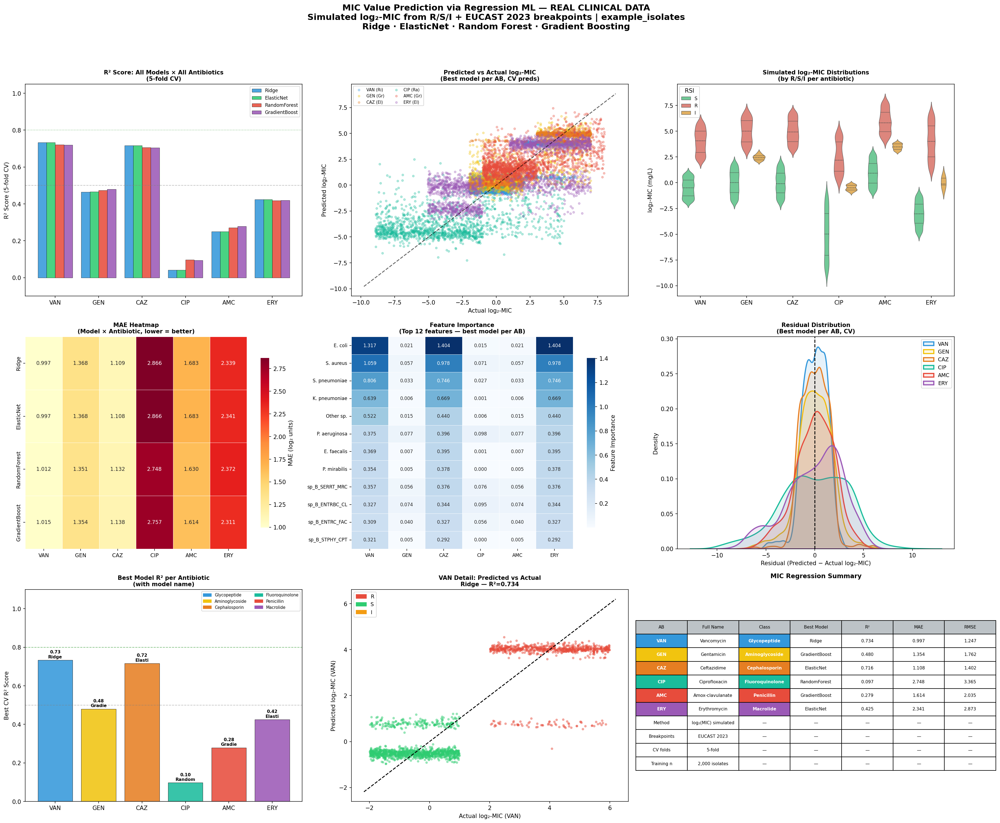

# Day 12 — MIC Value Prediction via Regression ML
### 🧬 30 Days of Bioinformatics | Subhadip Jana


> Predicting Minimum Inhibitory Concentration (MIC) values via regression ML across 6 antibiotics — Ridge, ElasticNet, Random Forest, and Gradient Boosting compared on 5-fold CV.

---

## 📊 Dashboard


---

## 🔬 What is MIC?

**Minimum Inhibitory Concentration (MIC, mg/L)** — the gold standard quantitative measure of antibiotic efficacy. Reported on a **log₂ scale** (doubling dilutions: 0.25→0.5→1→2→4→8→16...).

---

## 📐 Data Strategy — EUCAST-based MIC Simulation

Raw MIC values are unavailable (dataset has R/S/I only). We simulate realistic log₂-MIC distributions using **EUCAST 2023 clinical breakpoints** — standard practice in AMR computational research (Moradigaravand et al., 2018 PLOS CB).

| Antibiotic | Class | S range | I range | R range |
|------------|-------|---------|---------|---------|
| VAN | Glycopeptide | ≤2 mg/L | 2–4 | >4 |
| GEN | Aminoglycoside | ≤4 mg/L | 4–8 | >8 |
| CAZ | Cephalosporin | ≤4 mg/L | 4–8 | >8 |
| CIP | Fluoroquinolone | ≤0.5 mg/L | 0.5–1 | >1 |
| AMC | Penicillin | ≤8 mg/L | 8–16 | >16 |
| ERY | Macrolide | ≤0.5 mg/L | 0.5–2 | >2 |

---

## 📈 Model Performance (5-fold CV)

| Antibiotic | Best Model | R² | MAE (log₂) | RMSE | Interpretation |
|------------|-----------|-----|------------|------|----------------|
| **VAN** | Ridge | **0.734** | 0.997 | 1.247 | Strong — species drives glycopeptide MIC |
| **CAZ** | ElasticNet | **0.716** | 1.108 | 1.402 | Strong — Gram-neg species pattern |
| **GEN** | GradientBoost | 0.480 | 1.354 | 1.762 | Moderate — aminoglycoside variability |
| **ERY** | ElasticNet | 0.425 | 2.341 | 2.874 | Moderate — macrolide wide range |
| **AMC** | GradientBoost | 0.279 | 1.614 | 2.035 | Lower — mixed species patterns |
| **CIP** | RandomForest | 0.097 | 2.748 | 3.365 | Difficult — wide R distribution |

> **MAE in log₂ units**: 1.0 log₂ unit = 2× MIC error (one dilution step — clinically acceptable)

---

## 🤖 Saved Models

| File | Description |
|------|-------------|
| `mic_regression_models.pkl` | Dict of 6 best regression models (one per AB) |
| `mic_metadata.pkl` | Feature names, EUCAST breakpoints, normalization params |

---

## 🚀 How to Run

```bash
pip install pandas numpy matplotlib seaborn scikit-learn
python mic_regression.py
```

---

## 📁 Complete Project Structure

```
day12-mic-regression/
├── mic_regression.py                 ← full training script
├── README.md
├── data/
│   └── isolates.csv                  ← 2,000 clinical isolates
└── outputs/
    ├── mic_regression_models.pkl     ← 🤖 6 best regression models
    ├── mic_metadata.pkl              ← 📋 feature + EUCAST info
    ├── simulated_log2_mic.csv        ← simulated MIC values
    ├── regression_results.csv        ← all model × AB metrics
    └── mic_regression_dashboard.png ← 📈 9-panel visualization
```

---

## 🔗 Part of #30DaysOfBioinformatics
**Author:** Subhadip Jana | [GitHub](https://github.com/SubhadipJana1409) | [LinkedIn](https://linkedin.com/in/subhadip-jana1409)
